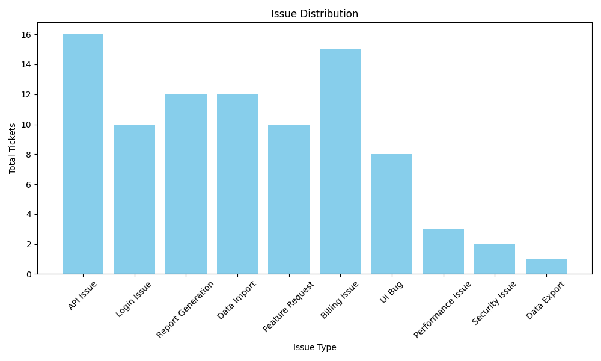
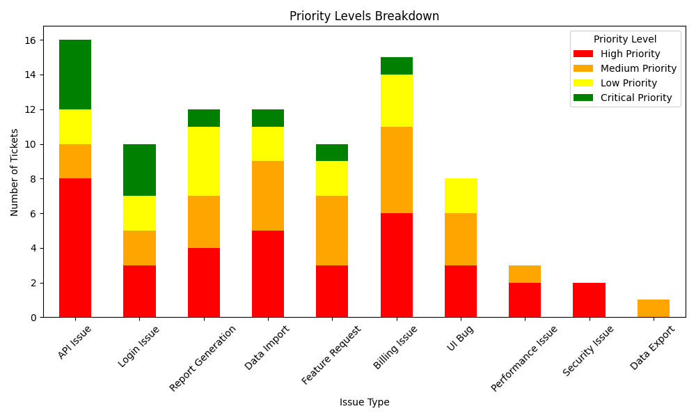
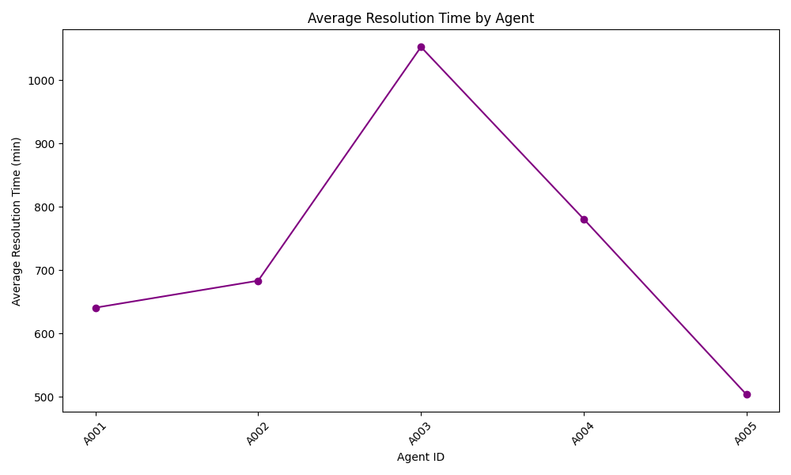
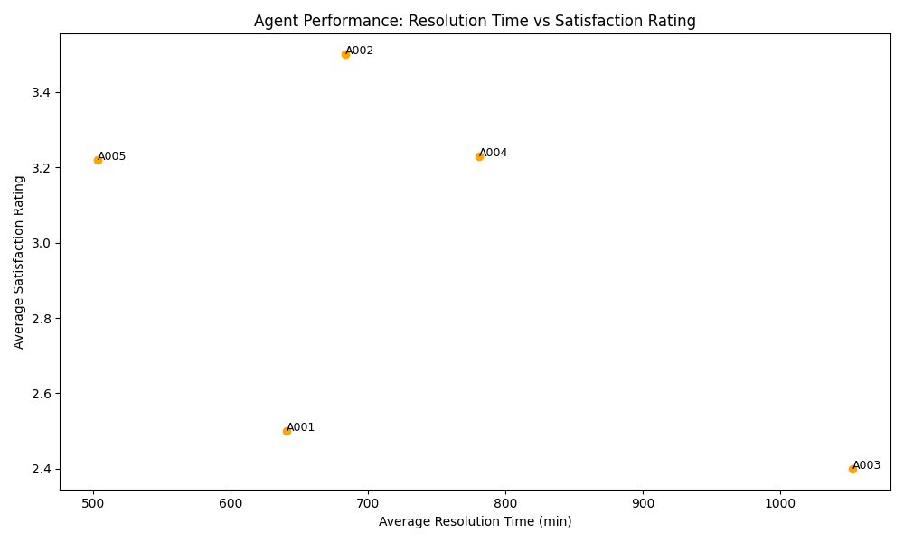

### Comprehensive Final Report: Support System Analysis

#### Issue Classification Results

| Issue Type         | Total Tickets | High Priority | Medium Priority | Low Priority | Critical Priority |
|---------------------|---------------|---------------|-----------------|--------------|-------------------|
| API Issue           | 16            | 8             | 2               | 2            | 4                 |
| Login Issue         | 10            | 3             | 2               | 2            | 3                 |
| Report Generation    | 12            | 4             | 3               | 4            | 1                 |
| Data Import         | 12            | 5             | 4               | 2            | 1                 |
| Feature Request     | 10            | 3             | 4               | 2            | 1                 |
| Billing Issue       | 15            | 6             | 5               | 3            | 1                 |
| UI Bug              | 8             | 3             | 3               | 2            | 0                 |
| Performance Issue   | 3             | 2             | 1               | 0            | 0                 |
| Security Issue      | 2             | 2             | 0               | 0            | 0                 |
| Data Export         | 1             | 0             | 1               | 0            | 0                 |

### Key Insights:
- API Issues are the most frequent, followed closely by Billing Issues and Login Issues.
- High priority issues require urgent attention, particularly the API and Billing categories, which have multiple unresolved tickets.

#### Suggested Actions by Category:

1. **API Issue**: Increase internal communication regarding recurrent issues; develop detailed troubleshooting guides for customer assistance.
2. **Login Issue**: Establish immediate follow-up and escalation procedures for unresolved tickets; refine communication resources for customers.
3. **Report Generation**: Conduct a systematic review of the report generation processes and address low customer satisfaction scores.
4. **Data Import**: Implement a tracking mechanism for recurring issues and improve error messages to facilitate better customer understanding.
5. **Feature Request**: Strengthen communication protocols to clarify timelines and enhance feedback mechanisms with customers.
6. **Billing Issue**: Create a dedicated team for billing inquiries to ensure prompt responses and establish streamlined processes for recurrent issues.
7. **UI Bug**: Allocate more resources for quick resolution of UI-related issues, enhancing user experience.
8. **Performance Issues**: Focus on proactive measures and customer feedback to improve system performance during peak times.
9. **Security Issues**: Maintain open channels for communication regarding security concerns and implement continuous monitoring strategies.

---

#### Agent Performance

| Agent ID | Total Resolved | Average Response Time (min) | Average Resolution Time (min) | Average Satisfaction Rating |
|----------|----------------|------------------------------|-------------------------------|-----------------------------|
| A001     | 12             | 103.33                       | 640.75                        | 2.5                         |
| A002     | 10             | 113.6                        | 683.4                         | 3.5                         |
| A003     | 12             | 165.5                        | 1052.8                        | 2.4                         |
| A004     | 13             | 110.36                       | 780.77                        | 3.23                        |
| A005     | 9              | 107.11                       | 503.33                        | 3.22                        |

### Key Insights:
- Agent performances vary, with some agents having significantly longer resolution times and lower satisfaction ratings, indicating areas where further training or resource allocation may be necessary.

---

#### Customer Satisfaction Trends

| Month-Year | Total Tickets | Average Satisfaction Rating |
|------------|---------------|-----------------------------|
| Jan-2023   | 10            | 3.0                         |
| Feb-2023   | 10            | 3.0                         |
| Mar-2023   | 12            | 2.83                        |
| Apr-2023   | 10            | 3.8                         |
| May-2023   | 14            | 3.29                        |
| Jun-2023   | 13            | 2.64                        |
| Jul-2023   | 8             | 3.88                        |

### Key Insights:
- Customer satisfaction fluctuates over the months, with noticeable declines in March and June. The spikes in April and July suggest potential successful initiatives that should be further explored and replicated.

---

### Suggested Actions for Improvement

- Implement training programs aimed at agents with lower satisfaction ratings to improve overall quality of service.
- Review customer feedback to understand decline in satisfaction and address underlying issues.
- Increase proactive customer engagement strategies, particularly during periods of lower satisfaction, to enhance overall customer experience.

---

### Visual Charts for Additional Insights

1. **Issue Distribution**: 
2. **Priority Levels Breakdown**: 
3. **Average Resolution Time by Agent**: 
4. **Customer Satisfaction Over Time**: 
5. **Agent Performance: Resolution Time vs Satisfaction Rating**: 

This report aims to provide stakeholders with a comprehensive overview of the support system’s performance, illustrating critical areas for improvement and actionable suggestions for enhancing customer satisfaction and issue resolution processes.

