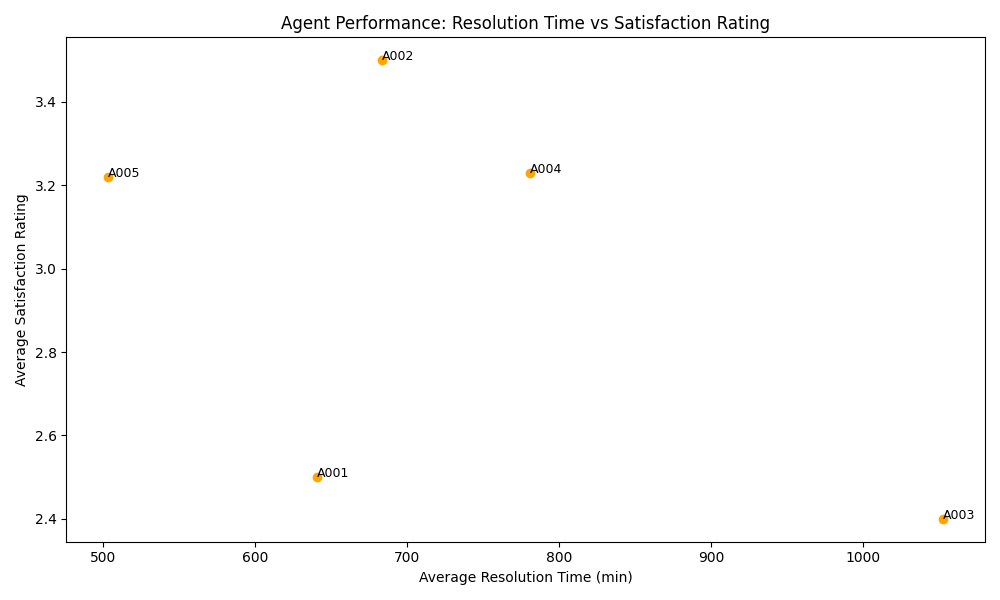
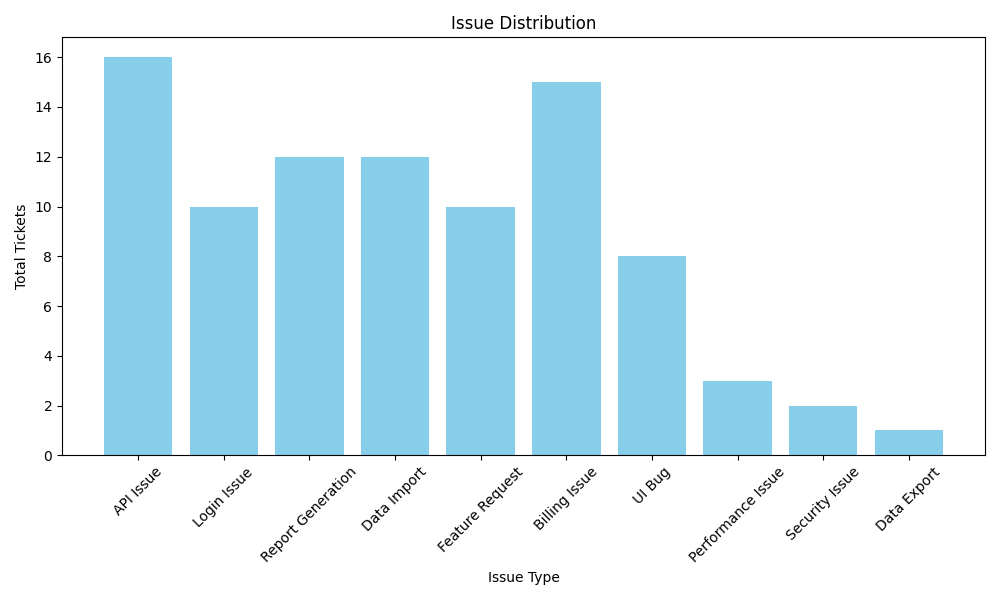
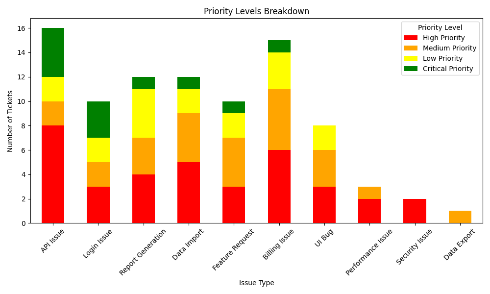

## Customer Support Data Analysis using Iterative Agent Training

### 1. Initial Training Phase
- Agents are operated on historical customer support data to generate initial reports.
- Performance metrics are established for evaluation
- Agents not able to incorporate generated visualizations and tables in the report
- Agents unable to give valuable feedback.
- Initial baseline capabilities are documented in [test_report.md](test_report.md)
### 2. Human Feedback Integration
- Expert review of agent responses
- Feedback incorporation through prompt engineering
- Performance improvement tracking
- Test results are documented in [training_report.md](training_report.md)
- Key metrics tracked:
  - Response accuracy
  - Resolution time
  - Customer satisfaction scores
- Agents able to incorporate generated visualizations and tables in the report.

### 4. Final Report Generation
- Comprehensive analysis of support agents performance
- Key insights and recommendations
- Future improvement strategies with Visualizations
- Final results are documented in [final_report.md](final_report.md)

### Data Analysis
The project includes comprehensive analysis using Agents and Tasks using CrewAI:
- Jupyter notebook ([customer-support-analysis.ipynb](cci:7://file:///Users/rafeyrana/Rafey/Personal/code/agent%20project/Customer%20Support%20Analysis%20Agents/customer-support-analysis.ipynb:0:0-0:0))

### Generated Reports
1. [Initial Report](test_report.md)
   - Initial agent performance

2. [Training Report](training_report.md)
   - Iterative incorporation of feedback on task results using Human Feedback

3. [Final Report](final_report.md)
   - Comprehensive performance analysis
   - Key insights and recommendations
   - Future improvement strategies

## Visualization Gallery

### Performance Metrics

- Shows agent response times and accuracy improvements

### Customer Satisfaction

- Tracks satisfaction scores over time

### Issue Analysis

- Breakdown of support ticket categories

### Priority Management

- Distribution of ticket priority levels

### Resolution Analytics

- Analysis of ticket resolution timeframes

## Key Achievements
- Successfully automated support task analysis and drawing insights for reports with iterative agent training and improvement on key tasks.
