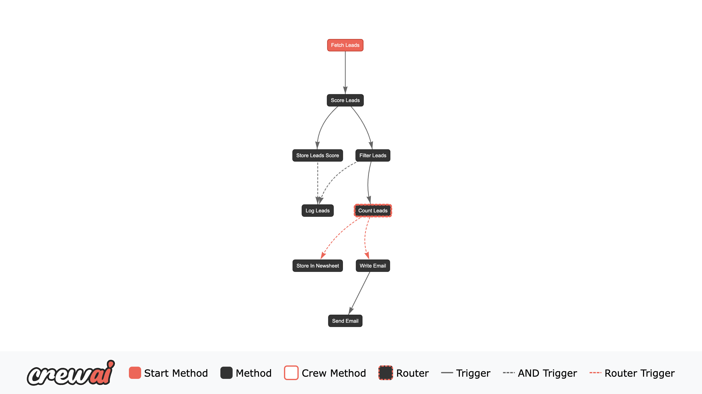

# Building an Agentic Sales Pipeline Using CrewAI

This repository showcases a **Sales Leads Agent** pipeline built with **CrewAI**. The pipeline automates lead management, scoring, and personalized email generation to create an effective and engaging sales process. 

## Key Features

1. **Lead Loading**  
   Loads leads generated from a Google Sheets form, ensuring seamless data integration.

2. **Lead Scoring Crew**  
   Evaluates leads based on cultural fit, mission alignment, and sales potential using advanced lead scoring metrics.

3. **Filtering Leads**  
   Separates leads based on their score. High-scoring leads are sent to a dedicated Google Sheet (`Hot Leads`).

4. **Email Writing Crew**  
   Personalizes and optimizes emails for each lead using professional email writing agents. 

5. **Google Sheets Integration**  
   - Tracks and updates leads with their respective scores in the original sheet.
   - High-quality leads are recorded in a dedicated sheet (`Hot Leads`).

## Pipeline Flow

The process follows the flow below:

1. **Loading Leads:**  
   Fetches data from a Google Sheet (`google_sheet_id` and `worksheet_name` specified in the environment). 

2. **Lead Scoring:**  
   Scores leads based on the following:  
   - Cultural fit  
   - Mission alignment  
   - Sales potential  

3. **Filter Based on Scores:**  
   Separates leads based on their score. High-scoring leads are sent to a dedicated Google Sheet (`Hot Leads`).

4. **Email Personalization and Engagement Optimization:**  
   Tailors professional and engaging emails for lower-scoring leads to maximize conversions.

5. **Score Logging and Reporting:**  
   All updates, including scores and email interactions, are logged in Google Sheets.

## Flow Visualization

Below is a visualization of the pipeline flow:

